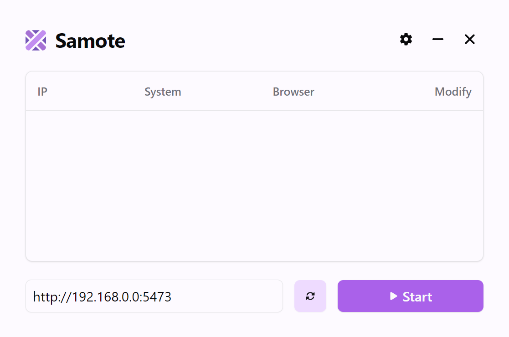

 <div align="center">
    
    <h1>Samote</h1>
    <b>An application for remote control via a website on your network.</b>
    <br>
    Now you can see your computer screen thanks to the live broadcast,
    control your keystrokes and keyboard. Everyone who connects to the
    website will be visible and under your control: you can authorize
    users, allow and deny to view the broadcast and control your computer.
    Also with the help of extensions you can increase the functionality
    of the program, for example, <a href="https://github.com/beachvisitor/samote-extensions/?tab=readme-ov-file#tunnel">automatically create a tunnel</a> to the website,
    which will make it available anywhere in the world.
    <br><br><br>
    <picture>
      <source width="100%" srcset="./dark.png" media="(prefers-color-scheme: dark)">
      
    </picture>
</div>

## Features

- **Security**
- **Support for different languages**
- **Host**
    - Users and their modification
    - Password system (Whoever enters it automatically gets all access)
    - Various settings such as auto-start stream, opening the program
      at system startup, changing stream command arguments and more
    - Extensions and their huge functionality
- **Client**
    - Simple and convenient control
    - Stream scaling and transformation
    - Realistic keyboard with different layouts

## Installation

> [!IMPORTANT]
> Currently available for Windows only.
1. Go to [releases](https://github.com/beachvisitor/samote/releases) and download the installer;
2. Open the installer and install the program;
3. That's it!

## Resources

All program resources such as extensions, settings, languages, layouts and logs are
located at `AppData/Roaming/Samote/resources`. If any data is missing, it will be
automatically downloaded. You can also create your own languages and layouts on
the basis of ready-made ones.

## Extensions

They allow you to add new unique functionality by accessing the program [API](src/api.js).
You can take a look at [these](https://github.com/beachvisitor/samote-extensions) pre-made extensions.

### Installation

1. Go to the [resources/extensions](#resources) folder;
2. Move there your extensions folder (which contains `package.json`);
3. Done!

### Creating

1. Create a folder for your extension;
2. In the folder, create a JS file and initialize the package: `npm init -y`;
3. Specify in package.json:
- `name` - extension name
- `main` - path to your JS file
4. Open the JS file and export your function to `module.exports`;
5. Complete!

> [!TIP]
> The function is executed when the extension is loaded.
It can take an API object as an argument and also return
a callback function that will be called when the extension is unloaded;

### Example

```
📁 extension
├── 📄 index.js
└── 📄 package.json
```

index.js
```javascript
// Let's create an extension which gives all access to the user immediately on login.

module.exports = ({ events, users }) => {
    // Listening to the add user event
    events.on('user:add', (id) => {
        // Authorizing and giving the user full access
        users.modify(id, {
            auth: true,
            access: {
                view: true,
                touch: true,
                keyboard: true
            }
        });
    });
};
```

package.json
```json
{
  "name": "extension",
  "version": "1.0.0",
  "main": "index.js",
  "keywords": [],
  "author": "normalped",
  "license": "MIT",
  "description": ""
}
```